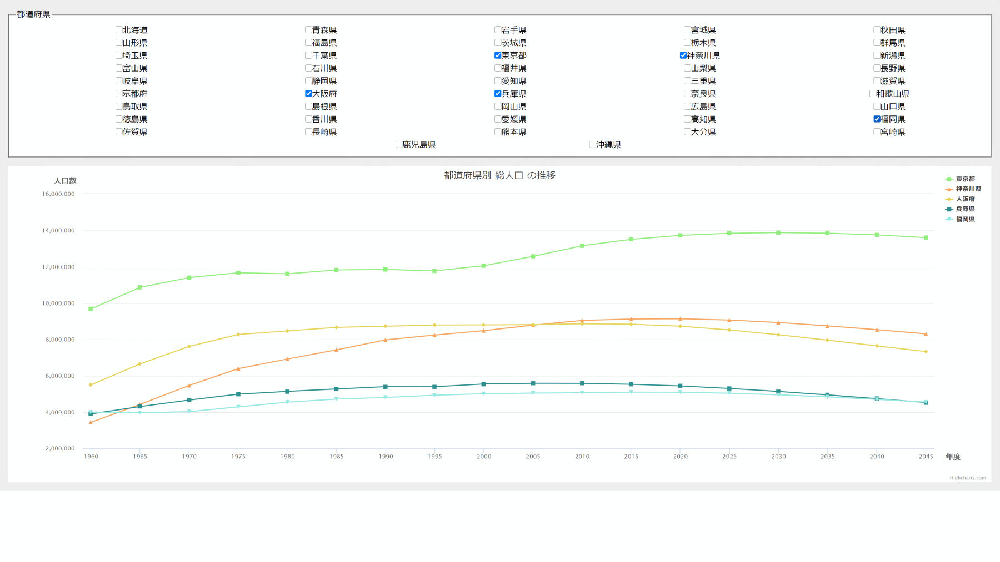

# 都道府県別の総人口推移グラフを表示するSPA(Single Page Application)



## DemoPage
- [デモページA](https://sakanaclub.xsrv.jp/prefecture-population-chart-nuxt/)
- [デモページB](https://sakanaclub.xsrv.jp/prefecture-population-chart-nuxt2/)

## 内容
- RESAS(地域経済分析システム) APIの「都道府県一覧」からAPIを取得する
- APIレスポンスから都道府県一覧のチェックボックスを動的に生成する
- 都道府県にチェックを入れると、RESAS APIから選択された都道府県の「人口構成」を取得する
- 人口構成APIレスポンスから、X軸:年、Y軸:人口数の折れ線グラフを動的に生成して表示する


## 関連サイト
- [人口構成多次元チャート (表示方式検証中)](https://sakanaclub.xsrv.jp/prefecture-population-dc/?data=population.csv)
- [人口構成ラインチャート < RESAS-API](https://resas.go.jp/population-composition/#/transition/13/13101/2017/0/5.333900736553437/41.42090017812787/142.29371418128918/-)

## Build Setup

```bash
# install dependencies
$ npm install

# serve with hot reload at localhost:3000
$ npm run dev

# build for production and launch server
$ npm run build
$ npm run start

# generate static project
$ npm run generate
```

For detailed explanation on how things work, check out [Nuxt.js docs](https://nuxtjs.org).
